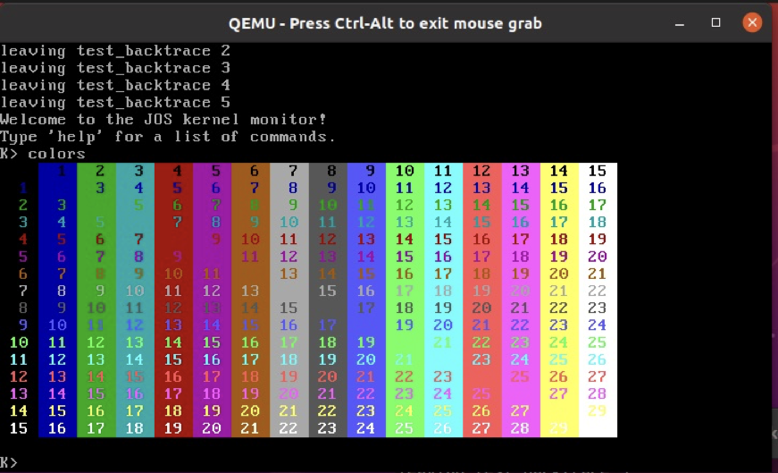
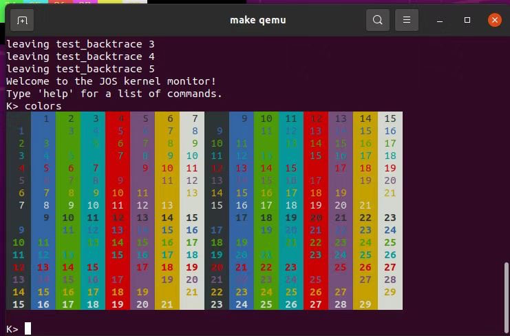

# LAB1, START UP A PC

**I finish the challenge of enhancing the console to print texts in different colors. For details just look into the *Challenge* section of my report.**

Reports of the coding parts are in *Exercise 8.*, *challenge*, *Exercise 11.* and *Exercise 12.* sections in this report.

My report starts with the graph of the physical memory status. I think it is something important acoss all the labs and the OS.

## The PC's Physical Address Space

```
+------------------+  <- 0xFFFFFFFF (4GB)
|      32-bit      |
|  memory mapped   |
|     devices      |
|                  |
/\/\/\/\/\/\/\/\/\/\

/\/\/\/\/\/\/\/\/\/\
|                  |
|      Unused      |
|                  |
+------------------+  <- depends on amount of RAM
|                  |
|                  |
| Extended Memory  |
|                  |
|                  |
+------------------+  <- 0x00100000 (1MB)
|     BIOS ROM     |
+------------------+  <- 0x000F0000 (960KB)
|  16-bit devices, |
|  expansion ROMs  |
+------------------+  <- 0x000C0000 (768KB)
|   VGA Display    |
+------------------+  <- 0x000A0000 (640KB)
|                  |
|    Low Memory    |
|                  |
+------------------+  <- 0x00000000
```

[1]

## The ROM BIOS

The first instruction that the PC excutes when we turn on it locates at 0xffff0, which is at the very top of the 64KB area reserved for the ROM BIOS.

```assembly
[f000:fff0]    0xffff0: ljmp   $0xf000,$0xe05b
```

I learn from the GDB that the physical address 0xffff0 is presented as [f000:fff0]. In fact, when we start up a PC, the processor enters *real mode*, where segment address(CS:IP) is used and the way we turn it into a physical address is defined as below:
$$
 physical address = 16 * segment + offset
$$
### Exercise 2.

Then the PC processes some pre-defined codes to do some checks and settings:

1. Basic hardware test and configure
2. Testing the video interface
3. Testing rest of the RAM, the Keyboard and it's interface setup
4. Getting ready to load the Operating System and to communicate with the user.(Switch the control flow to the Boot Loader)   [2]

### What is "Real Mode"?

Memory is limited to only one megabyte in real mode,  which requires a 20-bit number to represent the address that is however unable to store in a single 8086's 16-bit register. Intel solved this problem by using two 16-bit values to determine an address, which is presented as a 32-bit *select:offset* pair. Ther first value of it is also called a *selector*.

In real mode, a selector value is a paragraph number of physical memory,  which denotes the beginning of the segment.[3] 

## The Boot Loader

The boot loader loads the kernel into memory, but before that, BIOS loads the boot loader first.

If the disk is bootable, the first sector(512 bytes) is called the boot sector, since this is where the boot loader code resides. The Boot Strap Loader in the BIOS reads the first sector of the boot disk. If the disk is a  floppy disk, the sector is just the right boot sector. If it is a Hard Drive, the sector contains the *Partition Table*, which indicates whether the disk has multiple partitions, and if so, which of them contains a Bootable Operating System. The bootable sector is just right located in the first logical sector of the corresponding partition.  BIOS loads the boot sector into memory at physical address 0x7c00 through 0x7dff, and then uses a `jmp` instruction to set the CS:IP register pair to transfer the control flow to the boot loader.[2]

The boot strap loader in the BIOS ROM is only there to load another boot loader from the disk, which makes it possible to select an alternative Operating System.

After the boot loader takes control, it switches the processor from real mode to *32-bit protected mode*. Then it loads the ELF file of kernel into memory and tranfers the control flow to the kernel. I dive a bit more deeper into what happens exactly to better answer the questions in Exercise 3, which I will illustrate below.

### Exercise 3.

1.Q:At what point does the processor start executing 32-bit code? What exactly causes the switch from 16- to 32-bit mode?

A:After the instruction below the processor starts excuting 32-bit code.

~~~assembly
[   0:7c2d] => 0x7c2d:  ljmp   $0x8,$0x7c32 # ljmp    $PROT_MODE_CSEG, $protcseg
~~~

The instructions below loads the address and size of GDT into GDTR(reg.), set the zero-bit of %cr0, which indicates whether the protected mode is on or not. After the instruction above, the value in register CS (selector value) is set to 0x8 due to the $ljmp$ instruction, which indicates the offset of code segment in GDT.

~~~assembly
[   0:7c1e] => 0x7c1e:  lgdtw  0x7c64 # lgdt    gdtdesc
[   0:7c23] => 0x7c23:  mov    %cr0,%eax
[   0:7c26] => 0x7c26:  or     $0x1,%eax
[   0:7c2a] => 0x7c2a:  mov    %eax,%cr0
~~~

#### More things about the GDT

I try to find out what happens after executing the instruction `0x7c1e:  lgdtw  0x7c64 # lgdt    gdtdesc` . The first thing I notice is the code below in `/boot/boot.S`,

```assembly
# Bootstrap GDT
.p2align 2                                # force 4 byte alignment
gdt:
  SEG_NULL				# null seg
  SEG(STA_X|STA_R, 0x0, 0xffffffff)	# code seg
  SEG(STA_W, 0x0, 0xffffffff)	        # data seg

gdtdesc:
  .word   0x17                            # sizeof(gdt) - 1
  .long   gdt                             # address gdt

```

whose disassembly code is interpreted incorrecly as some kinds of functions in `/obj/boot/boot.asm`.

```assembly
00007c4c <gdt>:
	...
    7c54:	ff                   	(bad)  
    7c55:	ff 00                	incl   (%eax)
    7c57:	00 00                	add    %al,(%eax)
    7c59:	9a cf 00 ff ff 00 00 	lcall  $0x0,$0xffff00cf
    7c60:	00                   	.byte 0x0
    7c61:	92                   	xchg   %eax,%edx
    7c62:	cf                   	iret   
	...

00007c64 <gdtdesc>:
    7c64:	17                   	pop    %ss
    7c65:	00 4c 7c 00          	add    %cl,0x0(%esp,%edi,2)
```

It seems that `lgdt    gdtdesc` loads some 6-bytes thing called `gdtdesc ` into a register, which records the address and the size of `gdt`. After searching from the internet I find the name of this special register, *global descriptor table register*, or GDTR. So it's clear about how the processor finds the GDT, but I want to learn more about the contents of GDT. Then I find the definitions of the macros in `/inc/mmu.h`.

```c
#define SEG_NULL						\
	.word 0, 0;						\
	.byte 0, 0, 0, 0
#define SEG(type,base,lim)					\
	.word (((lim) >> 12) & 0xffff), ((base) & 0xffff);	\
	.byte (((base) >> 16) & 0xff), (0x90 | (type)),		\
		(0xC0 | (((lim) >> 28) & 0xf)), (((base) >> 24) & 0xff)

#define STA_X		0x8	    // Executable segment
#define STA_E		0x4	    // Expand down (non-executable segments)
#define STA_C		0x4	    // Conforming code segment (executable only)
#define STA_W		0x2	    // Writeable (non-executable segments)
#define STA_R		0x2	    // Readable (executable segments)
#define STA_A		0x1	    // Accessed
```

After reading some meterials from wiki[4], I learn that each segment descriptor in GDT owns a base address, a limit number and some flags of the segment it refers to. These information is somehow broken into different parts in the 8-byte space due to some historical reasons, for backward compatibility. That's why we see some strange bit manipulations in the macro. 

Given all these clues, let me draw a conclusion. There are three descriptors in the GDT, and all of them refer to the same base address, 0x0, so the address pair(CS:IP) simply maps to the exact position whose values is contained in IP register, that's why we see `ljmp   $0x8,$0x7c32 # ljmp    $PROT_MODE_CSEG, $protcseg` and the next instruction is right at`0x7c32`. `0x8` shows the offset of the descriptor of code segment in GDT(the second descriptor), and `$protcseg` indicates the offset, or absolute address, of the first 32-bit instruction that the processor will execute.


2.Q:What is the *last* instruction of the boot loader executed, and what is the *first* instruction of the kernel it just loaded?

A:The last instruction of the boot loader executed is:

~~~assembly
=> 0x7d81:      call   *0x10018
~~~

 The first instruction of the kernel it just loaded is:

```
=> 0x10000c:    movw   $0x1234,0x472
```

We can easily answer this question by looking into `/boot/main.c` and `/obj/boot/boot.asm`:

```c
((void (*)(void)) (ELFHDR->e_entry))();
7d81:	ff 15 18 00 01 00    	call   *0x10018
```

It shows that the ELF header records the entry of the kernel, and the boot loader simply calls it to transfer the control flow.


3.Q:*Where* is the first instruction of the kernel?

A:The first instruction of the kernel locates at `0x10000c` as gdb indicates.

```assembly
=> 0x10000c:    movw   $0x1234,0x472
```


4.Q:How does the boot loader decide how many sectors it must read in order to fetch the entire kernel from disk? Where does it find this information?

A:The boot loader loads the ELF file of the kernel into memory, and it reads the ELF header to find out where the program header is and how many segments are there in the ELF file. As we know that the program header table is an array of structs where each element maps to a segment in the ELF file, by iterating this array, the boot loader gets the infomation of where all the segments of the kernel are and the sizes of them. So, the boot loader knows exactly how many sectors it should fetch and where to fetch to load the kernel into memory. It gets these necessary information through the ELF header and the program header table.

### What is "Protected Mode"?

In protected mode, a selector value is an index to a *descriptor table* called GDT. Just like the real mode, programs are divided into segments in protected mode, but the segments are not at some fixed positions in physical memory, even not in physical memory at all. It uses a technique called *virtual  memory*. The 80386 introduced 32-bit protected mode, which allows an offset to range up to 4 billion, and the segments can be divided into 4K-sized unit called *pages*.

In order to keep backward compatibility, modern processors boot up witch real mode and turns to protected mode afterwards.[3]

### Loading the kernel

In this section I follow the guide to do something about the ELF file and the linker. 

#### Exercise 5.

I think the first instruction that would "break" or do somthing wrong is the one that locates at `0x7c00` if I change the link address of the boot loader. In order to verify my deduction, I change the link address in `/boot/Makefrag` from `0x7c00` to `0x7c02` and recompile the lab. Here is the comparison between the disassembly code before and after the change.

```assembly
# before the change 
.globl start
start:
  .code16                     # Assemble for 16-bit mode
  cli                         # Disable interrupts
    7c00:	fa                   	cli    
  cld                         # String operations increment
    7c01:	fc                   	cld    

  # Set up the important data segment registers (DS, ES, SS).
  xorw    %ax,%ax             # Segment number zero
    7c02:	31 c0                	xor    %eax,%eax
  movw    %ax,%ds             # -> Data Segment
    7c04:	8e d8                	mov    %eax,%ds
    
    
# after the change
Disassembly of section .text:

00007c02 <start-0x2>:
    7c02:	66 90                	xchg   %ax,%ax

00007c04 <start>:
.set CR0_PE_ON,      0x1         # protected mode enable flag

.globl start
start:
  .code16                     # Assemble for 16-bit mode
  cli                         # Disable interrupts
    7c04:	fa                   	cli    
  cld                         # String operations increment
    7c05:	fc                   	cld    

  # Set up the important data segment registers (DS, ES, SS).
  xorw    %ax,%ax             # Segment number zero
    7c06:	31 c0                	xor    %eax,%eax
  movw    %ax,%ds             # -> Data Segment
    7c08:	8e d8                	mov    %eax,%ds
```

We can find that the code of boot loader shift to the higher address by 2 bytes, but BIOS will inform the processor to execute something undefined locates at `0x7c00`. To find out what will happen, I set a breakpoint at `0x7c00` .

```assembly
[   0:7c00] => 0x7c00:  xchg   %eax,%eax
```

The processor executes an unexpected instruction, and after I step in for a few more instructions the program crashes.

```assembly
Program received signal SIGTRAP, Trace/breakpoint trap.
[   0:7c2f] => 0x7c2f:  ljmp   $0x8,$0x7c36
```

I try to compare it with the disassembly code below, but it's confusing for the address of the instruction gdb shows doesn't match what the disassembly code says. Things in the memory really mess up.

```assembly
	movl    %eax, %cr0
    7c2e:	0f 22 c0             	mov    %eax,%cr0
  
  # Jump to next instruction, but in 32-bit code segment.
  # Switches processor into 32-bit mode.
  ljmp    $PROT_MODE_CSEG, $protcseg
    7c31:	ea                   	.byte 0xea
    7c32:	36 7c 08             	ss jl  7c3d <protcseg+0x7>
```

#### Exercise 6.

At the point the BIOS enters the boot loader, the 8 words at `0x00100000` are:

```assembly
(gdb) x/4x 0x00100000
0x100000:       0x00000000      0x00000000      0x00000000   0x00000000
```

and then at the point the boot loader enters the kernel:

```assembly
(gdb) x/4x 0x00100000
0x100000:       0x1badb002      0x00000000      0xe4524ffe   0x7205c766
```

The reason why they are different is that the boot loader loads the segments of the kernel into `0x00100000`. It is the segment of the kernel at the second breakpoint. To answer this question more precisely, I look into the information that `objdump -x obj/kern/kernel` prints.

```assembly
# something...
Program Header:
    LOAD off    0x00001000 vaddr 0xf0100000 paddr 0x00100000 align 2**12
         filesz 0x00007dac memsz 0x00007dac flags r-x
    LOAD off    0x00009000 vaddr 0xf0108000 paddr 0x00108000 a
# something...
Sections:
Idx Name          Size      VMA       LMA       File off  Algn
  0 .text         00001acd  f0100000  00100000  00001000  2**4
                  CONTENTS, ALLOC, LOAD, READONLY, CODE
  1 .rodata       000006bc  f0101ae0  00101ae0  00002ae0  2**5
                  CONTENTS, ALLOC, LOAD, READONLY, DATA
  2 .stab         00004291  f010219c  0010219c  0000319c  2**2
                  CONTENTS, ALLOC, LOAD, READONLY, DATA
  3 .stabstr      0000197f  f010642d  0010642d  0000742d  2**0
                  CONTENTS, ALLOC, LOAD, READONLY, DATA
  4 .data         00009300  f0108000  00108000  00009000  2**12
```

So it's clear that they are different segments or sections of the kernel starting at `0x00100000`.

## The Kernel

Finally, the kernel takes control. The kernel does some settings that makes the C language code executes properly.

### Using virtual memory to work around position dependence

I have already known that the load address and link address of the kernel are quite different, which we can see from the messages `objdump` generates in the previous section. In this part, we only map the first 4MB of physical memory.  After the instruction `movl   %eax, %cr0` sets the `CR0_PG` flag, memory references change from physical address to virtual address, which translate virtual memory in the range `0xf0000000` through `0xf0400000` as well as  `0x00000000` through` 0x00400000` to physical address' 0x00000000' through '0x00400000'.

#### Exercise 7.

Here is the comparison before and after the instruction `movl   %eax, %cr0` sets the `CR0_PG` flag of the memory at `0x00100000` and `0xf0100000`.

```assembly
=> 0x100025:    mov    %eax,%cr0
0x00100025 in ?? ()
(gdb) x/4x 0x00100000
0x100000:       0x1badb002      0x00000000      0xe4524ffe    0x7205c766
(gdb) x/4x 0xf0100000
0xf0100000 <_start-268435468>:  0x00000000      0x00000000    0x00000000       0x00000000
(gdb) si
=> 0x100028:    mov    $0xf010002f,%eax
# after
0x00100028 in ?? ()
(gdb) x/4x 0x00100000
0x100000:       0x1badb002      0x00000000      0xe4524ffe    0x7205c766
(gdb) x/4x 0xf0100000
0xf0100000 <_start-268435468>:  0x1badb002      0x00000000    0xe4524ffe       0x7205c766
```

We can see that after the flag is set, address `0xf0100000` maps to `0x00100000` exactly.

If the mapping weren't in place, the first instruction that would fail to work should be `    jmp *%eax`, for the address `$0xf010002c` stored in `%eax` won't be mapped to `0x0010002c` . And here is the result I get after I comment out the flag setting instruction.

```assembly
from gdb:
=> 0x10002a:    jmp    *%eax
0x0010002a in ?? ()
(gdb) si
=> 0xf010002c <relocated>:      add    %al,(%eax)
relocated () at kern/entry.S:74
74              movl    $0x0,%ebp                       # nuke frame pointer
(gdb) si
Remote connection closed

from qemu:
qemu: fatal: Trying to execute code outside RAM or ROM at 0xf010002c
```

In conclusion, the kernel would fail to work if the mapping weren't properly set, memory reference to high address won't be mapped to lower address of the physical memory and thus it would cause an error.

### Formatted Printing to the Console

#### Exercise 8.

It's easy to find the code that deals with the formatted printing in `/lib/printfmt.c`, function `void vprintfmt(void (*putch)(int, void*), void *putdat, const char *fmt, va_list ap)`.

The only thing I need to do is to fetch the number from the `va_list` and set the base to 8, then leave it to the procedure following `number`.

```c
case 'o':
			// Replace this with your code.
			num = getuint(&ap, lflag);
			base = 8;
			goto number;
```


Following questions:

1.Q:Explain the interface between `printf.c` and `console.c`. Specifically, what function does `console.c` export? How is this function used by `printf.c`?

A: `printf.c1`  calls a function from `console.c` to output a character to the console.  `console.c` exports function `void cputchar(int c)` to `printf.c`, and  `printf.c`  wraps this function inside `static void putch(int ch, int *cnt)` to provide an interface to output a character and increase a counter.

2.Q:Explain the following from console.c:

```c
1      if (crt_pos >= CRT_SIZE) {
2              int i;
3              memmove(crt_buf, crt_buf + CRT_COLS, (CRT_SIZE - CRT_COLS) * sizeof(uint16_t));
4              for (i = CRT_SIZE - CRT_COLS; i < CRT_SIZE; i++)
5                      crt_buf[i] = 0x0700 | ' ';
6              crt_pos -= CRT_COLS;
7      }
```

A: I find some macros in `/kern/console.h`,

```c
#define CRT_ROWS	25
#define CRT_COLS	80
#define CRT_SIZE	(CRT_ROWS * CRT_COLS)
```

with a case of the `switch` statement in `/kern/console.c`.

```C
	default:
		crt_buf[crt_pos++] = c;		/* write the character */
		break; 
```

Then it's quite natural to make a deduction that `crt_buf` points to a logical double dimension array, which maps to a rectangular console we know about, with rows and columns of characters shown on the screen. Then the code that the question asks about shows the procedure to perform when the number of the characters shown on the console exceeds its limit. It just simply shift the content of the buffer forward by one row and fill the last row with spaces, simple put, it scrolls up the console by one row.

3.Q:Trace the execution of the following code step-by-step:

```
int x = 1, y = 3, z = 4;
cprintf("x %d, y %x, z %d\n", x, y, z);
```

- In the call to `cprintf()`, to what does `fmt` point? To what does `ap` point?

- List (in order of execution) each call to `cons_putc`, `va_arg`, and `vcprintf`. For `cons_putc`, list its argument as well. For `va_arg`, list what `ap` points to before and after the call. For `vcprintf` list the values of its two arguments.

  

A: 

- `fmt` points to `"x %d, y %x, z %d\n"`. `ap` points to the address right after `fmt`(not the string it points to!).
-  

```c
vcprintf(fmt, ap); 
// fmt: the address of "x %d, y %x, z %d\n"
// ap: the address right after fmt
cons_putc('x');
cons_putc(' ');
va_arg(ap, int); //before: &x, after: &y
cons_putc('1');
cons_putc(',');
cons_putc(' ');
cons_putc('y');
cons_putc(' ');
va_arg(ap, unsigned int); //before: &y, after: &z
cons_putc('3');
cons_putc(',');
cons_putc(' ');
cons_putc('z');
cons_putc(' ');
va_arg(ap, int); //before: &z, after: 4 bytes after &z
cons_putc('4');
cons_putc('\n');
```


4.Q:Run the following code and explain the output.

```c
    unsigned int i = 0x00646c72;
    cprintf("H%x Wo%s", 57616, &i);
```

A: The output is `He110 World`. The number 57616 is represented in hexadecimal as e110, that's easy to explain the first part of this question. The second part is a bit more complicated. In little-endian x86 machine, number 0x00646c72 stores in the memory as `72 6c 64 00` in ascending order of the address.`%s` tells the function to interpret these memory bytes as a string, so `72 6c 64 00 ` maps to `'r' 'l' 'd' ''`.

If the x86 were big-endian, I would set `i` to `0x726c6400` to get the same output, but I won't change 57616 to another value, for its hexidecimal value has nothing to do with big-endian or small-endian.

5.Q:In the following code, what is going to be printed after `y=` ? Why does this happen?

```c
    cprintf("x=%d y=%d", 3);
```

A: It depends on the 4-byte content in the memory right after  `ap+sizeof(int)` at the time when `ap` is initialized. Because `va_list` is actually the type `const char *`, and the function loads these variable number of arguments by going through this byte stream, reinterpreting them and moving the iterator by specific type. In this case, there is only one argument but we have two `%d` in `fmt`, so `cprintf` will refers to the next 4 bytes right after the first 4 bytes.

6.Q:Let's say that GCC changed its calling convention so that it pushed arguments on the stack in declaration order, so that the last argument is pushed last. How would you have to change `cprintf` or its interface so that it would still be possible to pass it a variable number of arguments?

A: The order of the arguments stored in the memory would be reverse, so the order we go through the variable arguments list would be going down through the memory rather than going up.

#### <strong style="color:red;">Challenge</strong>

In this challenge, I need to enhance the console to print some colorful texts. 

To begin with, I found some materials about the encoding format of different colors in VGA text mode. Briefly speaking, each character is encoded by 2 bytes, and here is its structure.[5]

```assembly
--------------------------------------------------------
|0xf    |     0xe~0xc     |    0xb ~8  			  | 7~0    |
--------------------------------------------------------
|blink  |background color | foreground color  |  ASCII |
--------------------------------------------------------
```

By specifing the second byte of the input character and stores it into the VGA buffer `crt_buf`, the console will print the character in the color I want. 

At first, I tried to make the console interpret ANSI escape sequences. However, I found it quite troublesome to analyze the input stream, for I need to consider quite a lot of inputs that violate the format and I need to handle them properly.

Therefore, I came up with an idea inspired by the stream operator in C++. The console would expose two interfaces about color. The first one, `cga_set_color(int foreground_color_, int background_color_)`, which changes the color mode of the console. After specifying the colors with this function, the following texts printed by the console would be in the colors specified until the next `cga_set_color` changes the colors, or the second function cancels it. So the second function  `cga_back_to_default_color()` would set the color mode in default status. I enumerate all the supported colors in `/inc/stdio.h` for convenience. This is an example of how to use it.

```C
cga_set_color(Green, Red);
cprintf("green and red");
cga_set_color(Yellow, Blue);
cprintf("yellow and blue");
cga_back_to_default_color();
cprintf("default color");
```

The way I implement this function is to define **two static variables** in `kern/console.c`, the first one stands for the foreground color and the second one stands for the background color. `cga_set_color` just changes these two variables into the proper codes representing the colors. Each time a character is to be written into the VGA buffer in function `cga_putc`, its higher byte will be modified properly based on the two variables. 

This finishes the challenge. However, my color operators only support the console in qemu for now. To make it support the serial I/O in the terminal, I add the same color operators for the serial I/O functions, which use ANSI escape sequences to change the color mode just like the operators for the VGA do.

I add a command in the console whose name is "color", which will display all the colors supported. Here is the presentation. The first one is in qemu console and the second one is in user terminal.




### The Stack

#### Exercise 9.

The kernel initializes the stack by storing the stack pointer in `%esp`, as the instruction at `0xf0100034` shows.

```assembly
=> 0xf0100034 <relocated+5>:    mov    $0xf0110000,%esp
relocated () at kern/entry.S:77
77              movl    $(bootstacktop),%esp
```

Check the code in `/kern/entry.S`. The kernel reserves 32KB for the stack, and the stack pointer initializes to point to the end which locates at the higher address as the stack grows from higher address to lower address.

```assembly
.data
###################################################################
# boot stack
###################################################################
	.p2align	PGSHIFT		# force page alignment
	.globl		bootstack
bootstack:
	.space		KSTKSIZE
	.globl		bootstacktop   
bootstacktop:
```

#### Exercise 10.

Three 32-bit words are pushed to the stack when the function `test_backtrace` recursively calls itself. The first one is the base pointer of the previous function in the stack. The second one is the argument that needs to be passed to the nested `test_backtrace`. The third one is the address of the instruction to be excecuted after the nested `test_backtrace` returns.

#### Exercise 11.

To print the backtrace information in the stack, we should be clear about what is the necessary information in the stack.

```assembly
+------------------+  		Higher address
|        ebp       |
+------------------+  <- ebp of caller's caller
|   							 |
/\/\/\/\/\/\/\/\/\/\

/\/\/\/\/\/\/\/\/\/\
|                  |
+------------------+  <- arguments passed to the callee
|        rip       |
+------------------+  <- the instruction address to which control will return
|        ebp       |
+------------------+  <- ebp of the caller
|                  |
/\/\/\/\/\/\/\/\/\/\       Lower address
```

As the graph shows above, if we can get the `ebp` value of the current function, then we can traverse the stack through the link of all the `ebp` values until `ebp` equals to zero. And the information we need to produce the backtrace can be fetched through some fixed offsets from where `ebp` points. Luckily, it's possible for us to get `ebp` through an embedded assembly instruction. This is the general idea of how I implement the backtrace function.

#### Exercise 12.

`stab`, or *symbol table*, is a section storing some debugging information in the ELF file, as we can see by running `objdump -x obj/kern/kernel`.

```assembly
  Program Header:
    LOAD off    0x00001000 vaddr 0xf0100000 paddr 0x00100000 align 2**12
         filesz 0x000080fa memsz 0x000080fa flags r-x
  // more things...
  Idx Name          Size      VMA       LMA       File off  Algn
  // more things...
  2 .stab         00004429  f01022fc  001022fc  000032fc  2**2
                  CONTENTS, ALLOC, LOAD, READONLY, DATA
```

We can see more details through `/init.s` generated by a gcc command.

```assembly
.file	"init.c"
	.stabs	"kern/init.c",100,0,2,.Ltext0
	.text
.Ltext0:
	.stabs	"gcc2_compiled.",60,0,0,0
	.stabs	"int:t(0,1)=r(0,1);-2147483648;2147483647;",128,0,0,0
	.stabs	"char:t(0,2)=r(0,2);0;127;",128,0,0,0
	.stabs	"long int:t(0,3)=r(0,3);-9223372036854775808;9223372036854775807;",128,0,0,0
```

Then I make a comparison between it and the contents of .stad section in the ELF file of the kernel generated by running `objdump -G obj/kern/kernel`.

```assembly
obj/kern/kernel:     file format elf32-i386

Contents of .stab section:

Symnum n_type n_othr n_desc n_value  n_strx String
// more things...
73     SO     0      2      f0100040 2889   kern/init.c
74     OPT    0      0      00000000 49     gcc2_compiled.
75     LSYM   0      0      00000000 64     int:t(0,1)=r(0,1);-2147483648;2147483647;
76     LSYM   0      0      00000000 106    char:t(0,2)=r(0,2);0;127;
77     LSYM   0      0      00000000 132    long int:t(0,3)=r(0,3);-2147483648;2147483647;
```

And here is the link information of the stab section in `/kern/kernel.ld`.

```assembly
.stab : {
		PROVIDE(__STAB_BEGIN__ = .);
		*(.stab);
		PROVIDE(__STAB_END__ = .);
		BYTE(0)		/* Force the linker to allocate space
				   for this section */
	}
```

In conclusion, the debugging information `init.s` generates are stored in the ELF file, and the boot loader loads it into the memory due to the fact that these sections are inside a segment which the program header contains. The link file sets the link address of this section and *provides* two global variables targeting the begin and the end of this section repectively, to which `debuginfo_eip` is able to access and assigns them to two `__STAB_*` variables.

With what we've known for now, it's possible for us to extend the backtrace function by analyzing the debugging information. The stab section is considered as an array of `struct Stab`, and if we select a specific type `n_type` and build a subarray whose elements are all of this type, then the instruction address `n_value` in this subarray is in ascending order. Thus, it's possible to use binary search to find the interval of a specific type whose elements are of the same wanted address. 

To finish the task, I need to get the information of the name the source file, the line within this file, the function in this file and the offset of the `eip` from the first instruction, with respect to the `eip`. In function `debuginfo_eip` in file `/kern/kdebug.c`, we narrow down the search area step by step using binary search.  First, we find the source file containing `eip`. Second, we search for the function based on the interval that step one has found. **Third, based on the interval found in the previous step, I specify `n_type` to `N_SLINE` and use binary search to find the line number corresponding to the `eip`. This is what we need to complete in `/kern/kdebug.c`. **Finally, we search backward for the filename.

```c
stab_binsearch(stabs, &lline, &rline, N_SLINE, addr);
	if(lline > rline){
		return -1;
	} else {
		info->eip_line = stabs[lline].n_desc;
	}
```

Just display all the information we need in the backtrace function, and this finishes LAB1.

# References

[1] Introduction of lab1, <https://pdos.csail.mit.edu/6.828/2018/labs/lab1/>

[2] Phil Storrs PC Hardware book, THE BIOS, POST and the Boot Strap Loader, <https://web.archive.org/web/20040318114524/http://members.iweb.net.au/~pstorr/pcbook/book1/post.htm>

[3] PC Assembly Language, Paul A. Carter,  November 11, 2003, Chapter 1.2.6, 1.2.7

[4] <https://wiki.osdev.org/GDT>, 2022.09.11

[5] <https://en.wikipedia.org/wiki/VGA_text_mode>, 2022.09.15

